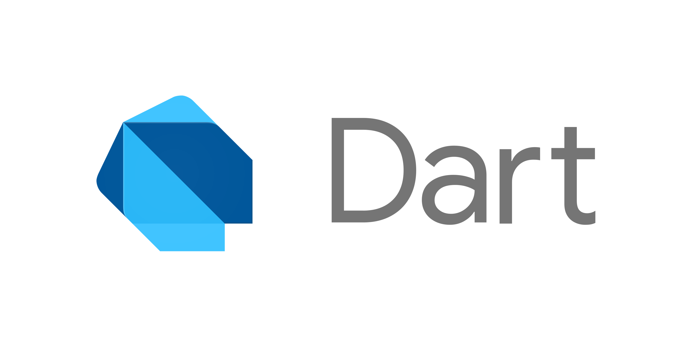

+++
author = "우명규"
title = "[Flutter] Flutter란? Flutter가 무엇일까?"
date = "2023-04-18"
description = "Flutter를 사용하는 목적과 특장점"
tags = [
    "dart",
    "flutter",
]
categories = [
    "App",
]
image = "flutter-logo.png"
+++

<!--more-->

## Flutter란?

> Flutter는 `Google`에서 개발한 [_크로스 플랫폼 모바일 앱 개발_](https://flutter.dev/multi-platform) 프레임워크

**크로스 플랫폼 모바일 앱 개발 프레임워크란?**

> iOS나 Android 두 OS에 대해 **하나의 코드베이스로 관리하여 여러 플랫폼에 동시에 서비스를 제공**하기 위한 프레임워크

## Native vs Cross Platform vs Hybrid

앱 서비스 개발시 3가지 방법으로 서비스를 제공할 수 있습니다.

1. 네이티브 앱
2. 크로스 플랫폼 프레임워크
3. 하이브리드 앱

### 네이티브 앱

네이티브 앱은 플랫폼의 네이티브 언어와 프레임워크를 이용해 개발하며 기기에 맞게 어플리케이션을 개발할 수 있지만, 여러 플랫폼에서 제공하기 위해서는 각각 개발을 할 수 있어야함

---

### 크로스 플랫폼 프레임워크

크로스 플랫폼 프레임워크는 하나의 코드베이스로 여러 플랫폼을 관리 및 서비스할 수 있으며 자바스크립트, C#, Dart를 안다면 개발을 시작할 수 있음

---

### 하이브리드 앱

하이브리드 앱은 웹페이지를 웹뷰로 감싸서 플랫폼처럼 서비스를 제공할 수 있으며 웹개발로 앱도 동시에 개발할 수 있고, 앱과 같은 경험을 만들어 줄 수 있음

---

> 자세한 내용은 추후에 더 포스팅을 하여 각 방법의 특장점을 살펴보도록 하겠습니다.

## 그렇다면 왜 Flutter는 CrossPlatform을 사용할까요?

모바일의 경우 iOS와 Android 개발자가 각각 있다면 CrossPlatform으로 개발하지 않아도 됩니다. 하지만, 각 OS별로 유저들에게 동일한 UI/UX를 제공하면서 개발하는 것은 결코 쉬운일이 아닙니다. 또, 각 OS별로 개발자가 필요하다보니 개발자원이 2배 이상 필요하게 됩니다. 그리고, 한명의 개발자가 두 OS 모두 개발한다고 하더라도 각 OS의 개발방식이 서로 다르기때문에 시간도 많이 소요됩니다.

개발을 완료했다쳐도 각 OS마다 앱의 유지보수가 쉽지 않다는 단점이 있습니다.

그래서 크로스 플랫폼을 사용한다면 개발 자원과 시간을 줄일 수 있으며, 하나의 프레임워크로 Android, iOS 둘 다 동시에 개발이 가능해집니다. 유지보수 측면에서도 하나의 코드베이스로 되어있다보니 훨씬 편리하게됩니다.

기존의 앱 시장에서는 `React Native`가 시장을 장악하고 있었지만, Flutter가 나온 후로 많은 개발자들이 유입되었고 커뮤니티또한 활발하게 성장하고 있습니다.

2023년 2월 기준으로 Stack Overflow Survey 2022에서 나온 결과를 보면 Flutter가 간소한 차이로 우위를 하고 있는 것을 볼 수 있습니다.

.png>)
[The results of the annual Stack Overflow Survey 2022](https://stackoverflow.blog/2022/05/11/stack-overflow-2022-developer-survey-is-open/)

또 아래에는 `React Native`와 `Flutter`의 비교영상입니다.

> https://www.youtube.com/watch?v=BqGxJ_ybE6k

## Flutter는 어떤 언어를 사용하나요?

Flutter는 [_Dart_](https://dart.dev/)라는 언어를 사용합니다. 이 Dart언어 또한 구글에서 개발한 언어입니다.

기존의 앱 개발자들에게는 또 다시 언어를 배워야한다는 단점이 있지만, 문법자체가 그렇게 어렵진 않은 것 같아 어느정도 개발을 하셨던 분들이라면 빠르게 적응하실 수 있을 것입니다.

Dart에 대하여 더 궁금한 내용은 [Flutter에서 사용하는 Dart언어란?](https://myeongcode.github.io/p/dart-flutter%EC%97%90%EC%84%9C-%EC%82%AC%EC%9A%A9%ED%95%98%EB%8A%94-dart%EC%96%B8%EC%96%B4%EB%9E%80/)을 봐주세요.

## Flutter의 특징

**장점**

- _**통합 개발 환경지원**_

  Flutter는 다양한 Editor(Android Studio, VS Code 등등)를 사용하여 빌드가 가능합니다.
  Android Studio는 Flutter Inspector와 Flutter Outline이라는 개발 도구를 추가적으로 지원해줍니다. VS code 에서는 간단하게 Extension 으로 Flutter를 설치하여 Flutter를 사용할 수 있습니다.

- _**성능 문제해결**_

  기존 React Native 혹은 Hybrid App의 경우 네이티브 브릿지를 통한 통신이 불가피했습니다.

  하지만 Flutter는 직접 컴파일되서 Render를 직접 하기때문에 성능이 빠릅니다. 애니메이션 속도가 60프레임은 가뿐히 넘어서는 것이 기존 크로스 플랫폼시장의 주류였던 React Native와 Flutter를 비교하는 많은 글들에서 Flutter를 내세우는 부분입니다.

- _**Mateiral Design & Cupertino**_

  Flutter는 Androd와 iOS의 대표 디자인 가이드를 기본적으로 제공합니다.
  구글의 머티리얼 디자인(Material Design)의 홈페이지에는 이미 Flutter가 포함되어 있고 가이드만 제공하는 것 뿐만아니라 Flutter 프로젝트에 바로 추가하여 사용할 수 있는 패키지도 제공합니다.

  안드로이드와 iOS에서 같은 머티리얼 디자인을 사용하더라도 플랫폼에 따라 다르게 출력되는 부분을 각각 디자인 가이드에 맞게 화면을 그립니다.
  iOS앱을 개발하는 경우 iOS특유의 디자인 시스템인 쿠퍼티노(Cupertino) 위젯을 제공합니다.

  그렇기에 선택의 폭이 정해져 있기 때문에 어떤 UI 라이브러리를 사용할 것인지 고민 할 필요가 없습니다만 이건 장점이자 단점이 될수도 있습니다.

- _**Dart뿐만 아니라 Native코드도 사용**_

  앞서 Dart를 사용한다고 했지만 결국엔 크로스 플랫폼이기에 해당 OS에 최적화된 앱을 만들려면 Native 코드를 사용할수밖에 없고 Dart와 섞어서 사용을 합니다.
  즉, Dart만 사용하는것이 아니라 Android면 Kotlin, iOS면 Swift도 사용합니다.
  이는 기존의 Native 코드를 사용한 개발자라면 장점이 됩니다.

**단점**

- **Native API를 Dart에서 직접 호출 불가**

  특별히 심하게 문제가 되진 않지만 외부 플러그인을 써야합니다.

- **코드를 고치려면 새 버전을 배포**

  React Native, Cordova, Ionic 에선 이미 지원 중 입니다.

  https://github.com/flutter/flutter/issues/14330

- **Air bnb Lotti 지원 X**

  Flutter는 지원하지 않습니다. Android, iOS, React-Native만 지원

  Lotti는 어플리케이션에 Fancy한 애니메이션을 넣어주는 라이브러리입니다.

  https://airbnb.design/lottie/

- **Wearable 디바이스앱에 약함**

  플러그인이 존재는 하지만 Native처럼 쉽게 되지는 않습니다.

- **C/C++ 라이브러리 호출 불가**

  NDK C/C++ 라이브러리 호출이 Dart에서 안됩니다. 외부 플러그인을 써야하고, 원하는 플러그인이 없다면 만들어야 하는데 이는 보통일이 아닙니다.

- **지원되는 플러그인이 부족**

  아직 플러그인들은 부족한 편입니다. 어플을 생성할 때, Webview, Map 등 플러그인은 필요합니다.

  하지만 Flutter의 이러한 플러그인들은 전부 0.4, 0.3 등등 1.0을 넘는 버전을 보기가 힘듭니다. 따라서 지속적으로 업데이트가 되고있고, 업데이트가 될때마다 다시 붙이고 테스트해보는 것은 어마어마하게 번거로운 일이 될 것입니다.

- **아직까진 국내에 개발관련 자료가 많이 없음**

  ndroid, iOS Native는 나온지 오래되서 자료가 많다보니 문제해결이 쉽습니다만, 국내엔 아직까진 자료가 많다고 할수가 없어 이슈 상황 발생시 자료 찾기가 어렵습니다.

  또한, Flutter 개발자들도 그렇게 많은 편이 아니기에 도움을 구하기도 어느정도 힘이 듭니다.

## 결론

점점 성장 중이며 React Native보다 사용을 많이한다고는 하지만, 아직 플러그인이 부족한 것은 사실이며 소규모로 빠르게 시작하기 위해서는 Flutter를 사용하는게 맞겠지만, 어느정도 규모가 있다면 각각의 OS에 맞는 전문 개발자를 뽑아서 개발하는 것이 질적으로 더 가치가 있을 것 같습니다.

아직 국내에 많은 레퍼런스가 없긴 하지만 학생으로서 Flutter로 빠르게 서비스를 제공하는 경험을 해보는 것도 괜찮을 것 같습니다. 기본적으로 괜찮은 기능들이 많고 React Native에서 힘들게 작업해야 하는 것을 Flutter에서는 손쉽게 구현하는 것도 코린이로서 이점이 될 수도 있습니다.

Flutter도 외국에 생각보다 많은 서비스를 하고있으며 지속적으로 업데이트되고 더 안정화가 된다면 강력한 프레임워크가 되지 않을까 생각합니다.

### 참고자료

https://blog.mayleaf.dev/24

https://velog.io/@jojo_devstory/Flutter%EB%9E%80-Flutter%EC%97%90-%EB%8C%80%ED%95%B4-%EC%95%8C%EC%95%84%EB%B3%B4%EC%9E%90#4-flutter%EC%9D%98-%ED%8A%B9%EC%A7%95
